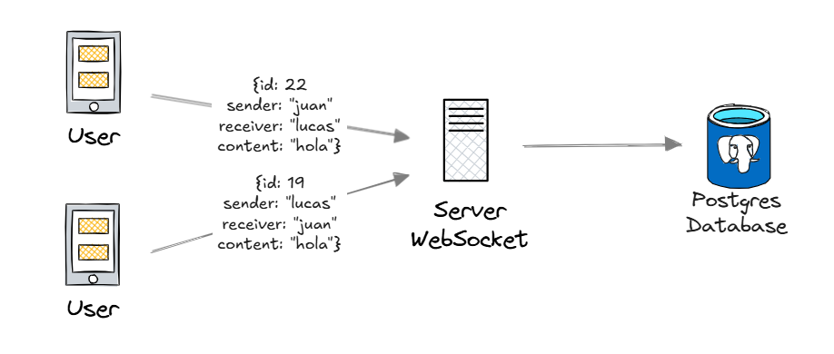
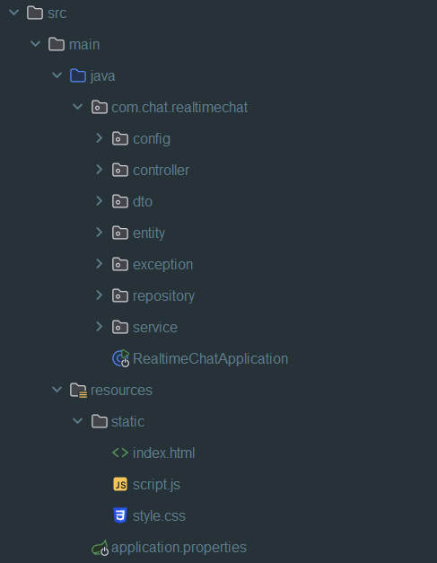
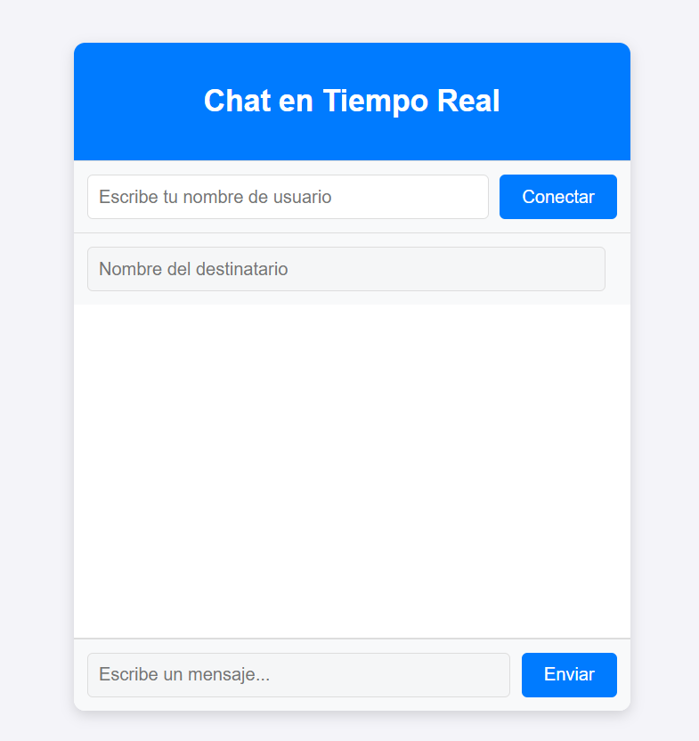
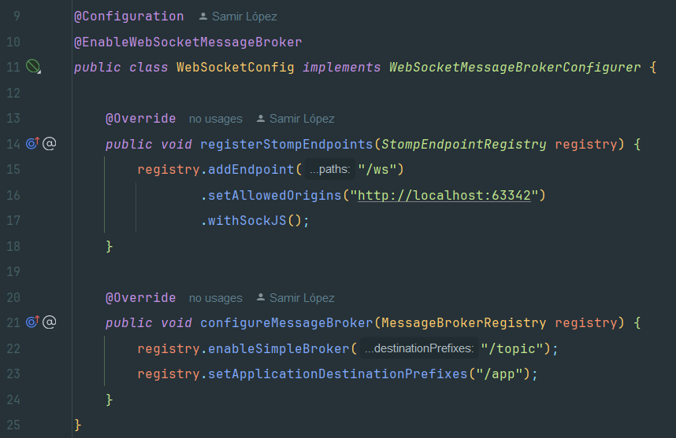

# 🚀 Real-Time Chat con WebSocket y Spring Boot




## 📝 Descripción

Este proyecto implementa una aplicación de chat en tiempo real utilizando WebSockets para la comunicación bidireccional entre clientes y servidor. Es una demostración de comunicación en tiempo real utilizando Spring Boot en el backend y JavaScript puro en el frontend.

La aplicación permite:
- Conectarse con un nombre de usuario
- Enviar mensajes a usuarios específicos
- Ver mensajes entrantes y salientes en tiempo real

## 🔧 Tecnologías Utilizadas

### Backend
- **Java 17+**
- **Spring Boot 3.4.3**
- **Spring WebSocket**
- **STOMP (Simple Text Oriented Messaging Protocol)**
- **SockJS**
- **Maven**

### Frontend
- **HTML5**
- **CSS3**
- **JavaScript (ES6+)**
- **SockJS Client**
- **STOMP.js**

## 🏗 Arquitectura

La aplicación sigue una arquitectura monolítica tradicional de Spring Boot con las siguientes capas:





El proyecto está organizado en las siguientes capas:

- **config**: Configuración de WebSocket y otros componentes de Spring
- **controller**: Controladores que manejan las peticiones WebSocket
- **dto**: Objetos de transferencia de datos para los mensajes
- **entity**: Entidades para persistencia de datos
- **repository**: Acceso a datos y persistencia
- **service**: Lógica de negocio y procesamiento de mensajes
- **exception**: Manejo centralizado de excepciones

La aplicación utiliza una arquitectura simple pero efectiva que sigue los principios de separación de responsabilidades, permitiendo mantener el código organizado y fácil de mantener.

## ✨ Características

- **Comunicación en Tiempo Real**: Mensajes entregados instantáneamente sin refrescar la página
- **Chat Privado**: Mensajes dirigidos a usuarios específicos
- **Interfaz Sencilla e Intuitiva**: Fácil de usar y entender
- **Arquitectura Escalable**: Diseñada para manejar múltiples conexiones simultáneas
- **Notificaciones de Sistema**: Indica conexiones y desconexiones
- **Historial de Mensajes**: Muestra todos los mensajes enviados y recibidos durante la sesión

## 💻 Instalación y Configuración

### Prerrequisitos

- JDK 17 o superior
- Maven 3.4.3 o superior
- Navegador web moderno

### Pasos de Instalación

1. Clonar el repositorio:
   ```bash
   git clone https://github.com/lopezsDev/realtime-chat.git
   cd realtime-chat
   ```

2. Construir el proyecto usando Maven:
   ```bash
   mvn clean install
   ```

3. Iniciar la aplicación:
   ```bash
   mvn spring-boot:run
   ```

4. Acceder a la aplicación en tu navegador:
   ```
   http://localhost:8080
   ```

## ⚙️ Configuración de la Aplicación

La aplicación utiliza un archivo `application.properties` para configurar diversos aspectos del sistema. A continuación se muestra la configuración completa con variables de entorno para mayor flexibilidad en diferentes entornos:

```properties
spring.application.name=realtime-chat

# Configuración de base de datos PostgreSQL
spring.datasource.url=jdbc:postgresql://${DB_HOST}:${DB_PORT}/${DB_NAME}
spring.datasource.username=${DB_USER}
spring.datasource.password=${DB_PASS}
spring.datasource.driver-class-name=org.postgresql.Driver

# Configuracion de JPA
spring.jpa.database-platform=org.hibernate.dialect.PostgreSQLDialect
spring.jpa.hibernate.ddl-auto=create-drop
spring.jpa.show-sql=true
spring.jpa.properties.hibernate.format_sql=true

# Configuracion del servidor
server.port=${APP_PORT}

# Configuracion de WebSocket
spring.websocket.enabled=true
```

### Explicación de Propiedades Clave

- **Nombre de la Aplicación**: Define el identificador único de la aplicación.
- **Configuración de Base de Datos**: Configura la conexión a PostgreSQL utilizando variables de entorno con valores predeterminados.
- **Configuración JPA**:
   - `hibernate.ddl-auto=create-drop`: Crea las tablas al iniciar y las elimina al detener (ideal para desarrollo).
   - `show-sql=true`: Muestra las consultas SQL en la consola para facilitar la depuración.
- **Puerto del Servidor**: Configurable mediante variable de entorno `APP_PORT`.
- **WebSocket**: Habilita el soporte para WebSockets en Spring Boot.

### Variables de Entorno

Para personalizar la configuración en diferentes entornos, puede definir las siguientes variables:

| Variable | Descripción | Valor Predeterminado |
|----------|-------------|----------------------|
| DB_HOST  | Host de la base de datos | localhost |
| DB_PORT  | Puerto de la base de datos | 5432 |
| DB_NAME  | Nombre de la base de datos | realtime-chat |
| DB_USER  | Usuario de la base de datos | postgres |
| DB_PASS  | Contraseña de la base de datos | 12345678 |
| APP_PORT | Puerto de la aplicación | 8080 |

Esta configuración facilita el despliegue en diferentes entornos como desarrollo,
pruebas y producción, permitiendo cambiar valores críticos sin modificar el código fuente.

## 🖱 Uso

1. **Ingresar nombre de usuario**: Introduce un nombre de usuario único y haz clic en "Conectar"
2. **Iniciar conversación**: Introduce el nombre del destinatario y escribe tu mensaje
3. **Enviar mensaje**: Presiona Enter o haz clic en el botón "Enviar"
4. **Recibir mensajes**: Los mensajes entrantes aparecerán automáticamente en la ventana de chat


## 📸 Capturas de Pantalla

### Interfaz de Chat


### Conexión WebSocket


## 🚀 Futuras Mejoras

- Implementación de autenticación y autorización con Spring Security
- Almacenamiento persistente de mensajes en base de datos
- Funcionalidad de chat grupal
- Notificaciones de estado (escribiendo, en línea, etc.)
- Envío de imágenes y archivos
- Interfaz de usuario mejorada con frameworks como React o Angular

## 👥 Contribuciones

Las contribuciones son bienvenidas. Para contribuir:

1. Haz fork del proyecto
2. Crea una rama para tu feature (`git checkout -b feature/chat-feature`)
3. Realiza tus cambios y haz commit (`git commit -m 'Add some chat feature'`)
4. Push a la rama (`git push origin feature/chat-feature`)
5. Abre un Pull Request

## 📫 Contacto

¿Tienes preguntas o comentarios sobre este proyecto? ¡Me encantaría saberlo!

[📧 Contáctame por Email](mailto:lopezs.dev@gmail.com)

---

⭐️ Este proyecto es parte de mi portafolio como desarrollador backend. Si te ha gustado, ¡dale una estrella! ⭐️
